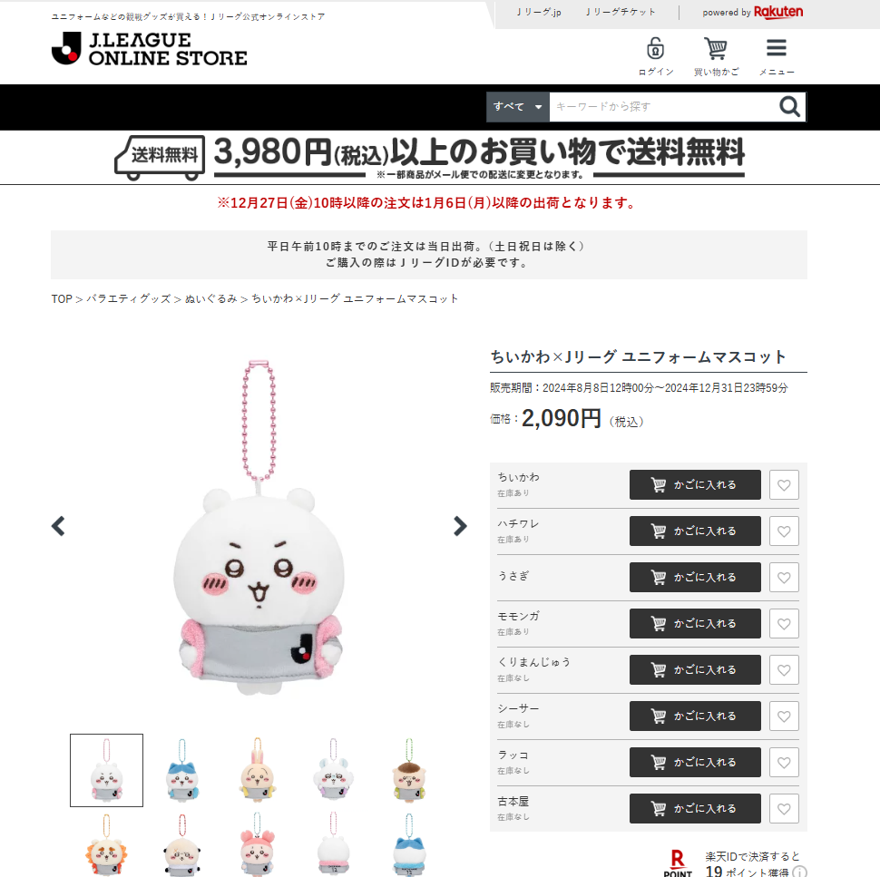

# J联盟与吉伊卡哇联动商店自动到货提醒程序
#### 1. 功能目前仅限提醒有货（会播放叮咚鸡），并不能直接下单。
#### 2. 非爬虫，用的是opencv图像识别（因此猜测可能会受不同设备和浏览器分辨率的影响，不一定适用他人。家人们想用的话，建议将图片文件夹的图片修改成自己设备上的截图，训练模型可能是让所有人都能适用的更佳选择）。
#### 3. 可根据自己的网页自行修改“刷新键”坐标参数，修改图片文件以选择你想监控的哪只或多只娃，还可以修改刷新间隔时间。
#### 4. 后期优化方向可以用机器学习分别训练模型以代替目前的图片库（由于商店到2024.12.31就会下架，应该没时间优化了）。

    

编译器：pycharm  
环境：python3.9.0  
商店链接：https://store.jleague.jp/item/P0000073404/ (程序正常启动后记得手动切到这个商店页面)  
初学者，做着玩的，嘴下留情qwq  
PS: 点红心会影响识别
