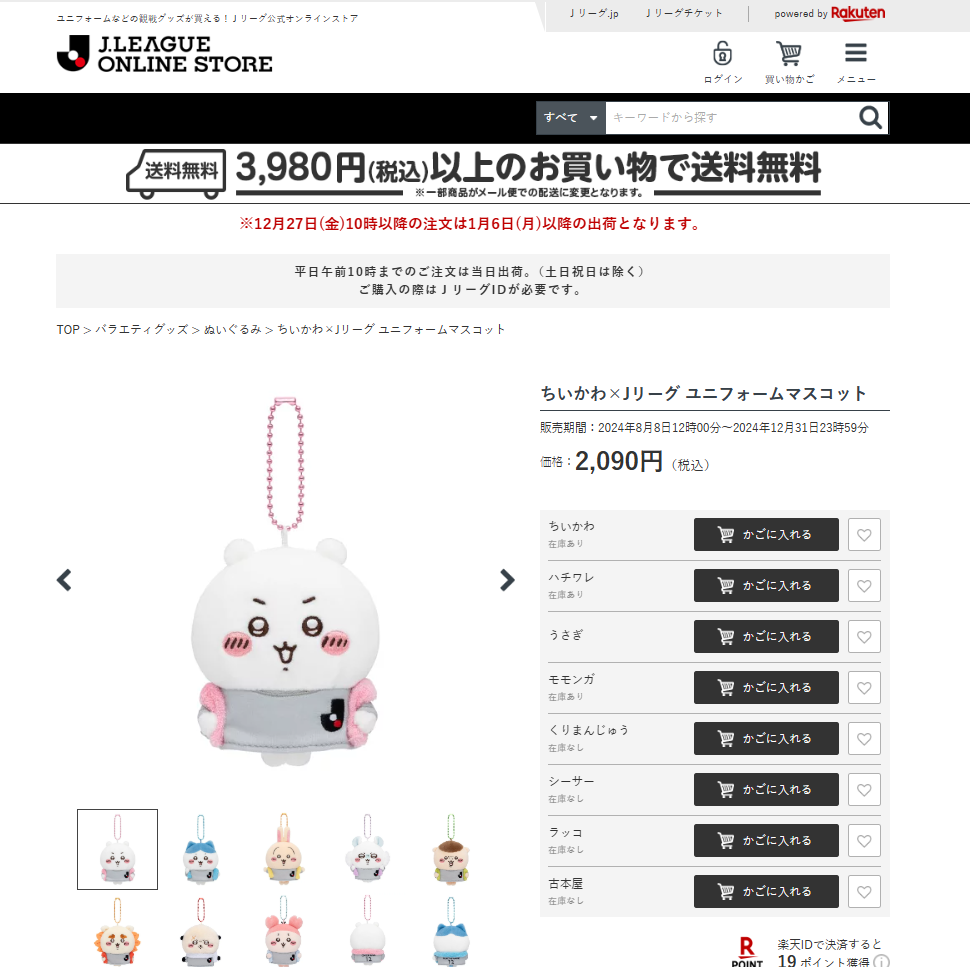

# J联盟与吉伊卡哇联动商店自动抢娃程序
#### 1. 功能目前仅限提醒有货，并不能直接下单。
#### 2. 非爬虫，用的是opencv图像识别。
#### 3. 可根据自己的网页自行修改“刷新键”坐标参数，修改图片文件以选择你想监控的哪只或多只娃，还可以修改刷新间隔时间。
#### 4. 后期优化方向可以用机器学习分别训练模型代替目前的图片库（因为猜测可能会受不同设备画质的影响，用模型训练可能是更佳选择）。

    

